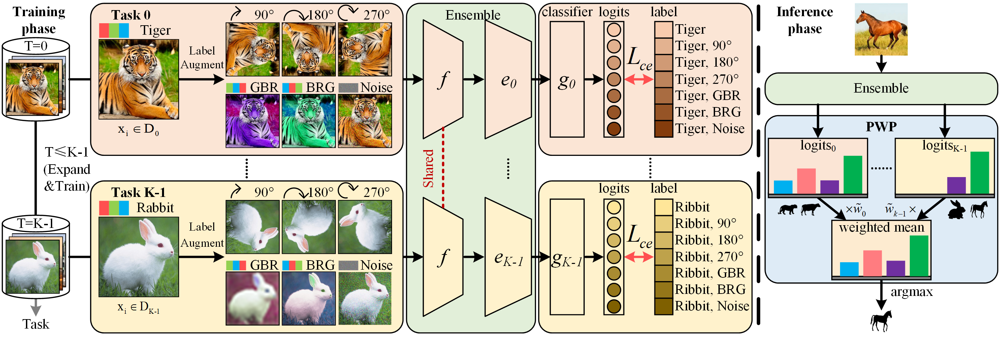

# CLOVER 
## Confusion-Driven Self-Supervised Progressively Weighted Ensemble Learning for Non-Exemplar Class Incremental Learning

| **[1 Introduction](#introduction)** 
| **[2 Requirements](#requirements)**
| **[3 Usage](#usage)**
| **[4 Citation](#citation)**
| **[5 Acknowledgments](#acknowledgments)** |

<a id="introduction"></a>
## Introduction

Official code for NeurIPS 2025 paper "[Confusion-Driven Self-Supervised Progressively Weighted Ensemble Learning for Non-Exemplar Class Incremental Learning]()".

> Non-exemplar class incremental learning (NECIL) aims to continuously assimilate new knowledge while retaining previously acquired knowledge in scenarios where prior examples are unavailable. A prevalent strategy within NECIL mitigates knowledge forgetting by freezing the feature extractor after training on the initial task. However, this freezing mechanism does not provide explicit training to differentiate between new and old classes, resulting in overlapping feature representations. To address this challenge, we propose a Confusion-driven seLf-supervised prOgressiVely weighted Ensemble leaRning (CLOVER) framework for NECIL. Firstly, we introduce a confusion-driven self-supervised learning approach that enhances representation extraction by guiding the model to distinguish between highly confusable classes, thereby reducing class representation overlap. Secondly, we develop a progressively weighted ensemble learning method that gradually adjusts weights to integrate diverse knowledge more effectively, further minimizing representation overlap. Finally, extensive experiments demonstrate that our proposed method achieves state-of-the-art results on the CIFAR100, TinyImageNet, and ImageNet-Subset NECIL benchmarks.

[//]: # (<div align=center></div>)


<a id="requirements"></a>
## Requirements

Upload this repository to "/kaijiang/yuzhang/projects":

```bash
cd CLOVER/
```

Install the dependencies:

```bash
export PATH="/kaijiang/yuzhang/anaconda3/bin:$PATH" ; source activate project1 ; cd /kaijiang/yuzhang/projects/CLOVER/
```

<a id="usage"></a>

## Usage

### Dataset Storage Format

Make sure your dataset is placed in the "/kaijiang/yuzhang/data" path and the directory structure is:

```
dataset/
├── CIFAR100/
│   └─── cifar-100-python/
│       ├── file.txt~
│       ├── meta
│       ├── test
│       └── train
├── tiny-imagenet-200/
│   ├── test/
│   ├── train/
│   ├── val/
│   ├── wnids.txt
│   └── words.txt.txt
└── seed_1993_subset_100_imagenet /
    ├── data/
    │   ├── samples
    │   ├── train
    │   └── test
    ├── ImageNet-Subset.tar
    ├── test.txt
    └── train.txt
```

### Running CLOVER

If you prepare your custom data following the above storage format, you can start training by executing the following command in the terminal.

#### CIFAR100

Run CLOVER on CIFAR100 50 base classes, 5 tasks, 10 classes each:
```bash
bash script/cifar100/50+5x10.sh
```

#### ImageNet-Subset

Run CLOVER on ImageNet-Subset 50 base classes, 5 tasks, 10 classes each:
```bash
bash script/imagenetSubset/50+5x10.sh
```

#### TinyImageNet

Run CLOVER on TinyImageNet 100 base classes, 5 tasks, 20 classes each:
```bash
bash script/tinyimagenet/100+5x20.sh
```


<a id="citation"></a>

## Citation

If you find our work is useful for your research, please consider citing:

```
@inproceedings{
    anonymous2025confusiondriven,
    title={Confusion-Driven Self-Supervised Progressively Weighted Ensemble Learning for Non-Exemplar Class Incremental Learning},
    author={Anonymous},
    booktitle={The Thirty-ninth Annual Conference on Neural Information Processing Systems},
    year={2025},
    url={https://openreview.net/forum?id=yflq8Bhjrw}
}
```

<a id="acknowledgments"></a>

## Acknowledgments

Our code is inspired by [SEED](https://github.com/grypesc/SEED) and [PASS](https://github.com/Impression2805/CVPR21_PASS).
